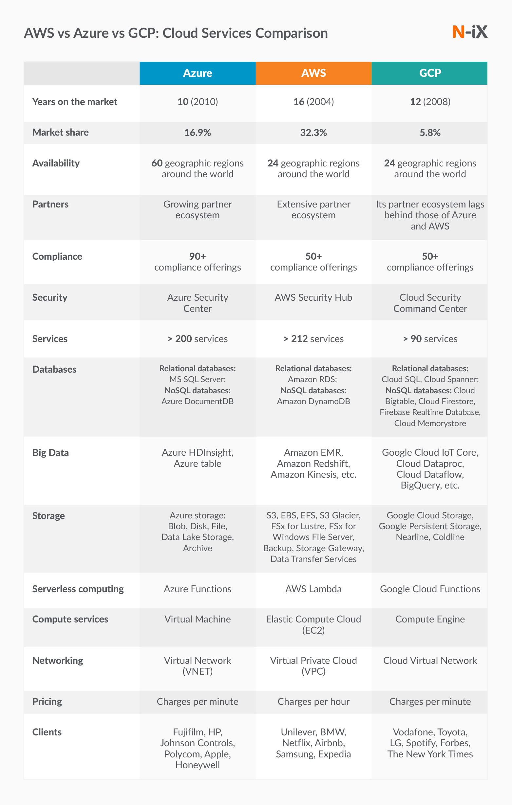
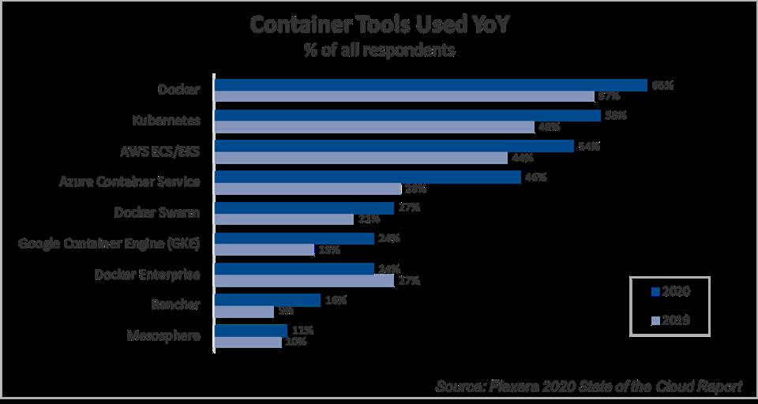
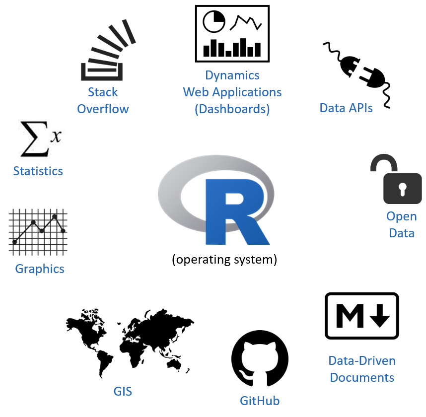
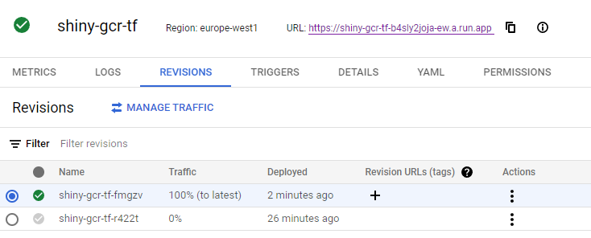

--- 
title: "FMISD19004 Cloud Computing Technologies"
author: "Kęstutis Daugėla"
date: "`r Sys.Date()`"
output:
  pdf_document: default
  html_document:
    df_print: paged
bibliography: references.bib
biblio-style: apalike
link-citations: yes
site: bookdown::bookdown_site
citation_package: natbib
---

# Introduction {-}


The underlying concept of cloud computing was introduced way back in 1960s by John McCarthy in his book, “The challenge of the Computer Utility”. His opinion was that “computation may someday be organized as a public utility.” The rest became history and the majority of the software used now is running in the cloud seamlessly [@CloudHistoryOverview].


Cloud can solve a lot of problems nowadays - starting with reduced cost, enhanced security, and flexible approach [@CloudReview] up to sustainability [@CloudSustainability] and accessibility around the world. Continuous Integration and Deployment (CI/CD) is easier than even treating now only the applications, but the whole infrastructure as code. This leads to enhanced productivity and cost optimization [@CloudAutomation]. 

Is there anything revolutionary in the cloud offerings today? Definitely, no - people used these capabilities for ages. The only difference is the scale and popularity these days.

Cloud services usually are grouped into three categories:

* SaaS (Software as a service) is a software distribution model in which a cloud provider hosts applications and makes them available to end-users over the internet
* PaaS (Platform as a service) is a complete development and deployment environment in the cloud, with resources that enable you to deliver everything from simple cloud-based apps to sophisticated, cloud-enabled enterprise applications
* IaaS (Infrastructure as a service) is a type of cloud computing service that offers essential compute, storage, and networking resources on-demand, on a pay-as-you-go basis


However,  despite  the  gain  achieved  from  cloud computing, organizations are slow in fully accepting it due to security issues and  challenges associated with it [@Cloud-computing].


In terms of the leading cloud service providers, the same three names usually appear - Amazon (AWS), Microsoft (Azure), and Google (GCP). These are also one of the 5 largest companies in the world by market capitalization. While AWS has strength in the engineering supply chain, large financial commitments and innovation, Google demonstrates significant revenue growth, innovation velocity and shows promising results in surveys. Moreover, since Google developed Kubernetes internally, GCP has the most fully-featured Kubernetes service of any provider in this market. Microsoft, on the other hand, already had a good reputation and trust as a software company [@Gartner].


# Moving to Cloud


## Managing SLA (SLO) requirements on clouds

One of the biggest challenges for potential cloud customers is to evaluate SLA’s of cloud vendors [@CloudSLA] [@CloudSLAComprehensive]. There are four major cloud setups in general:


1) **Public cloud**. In this setup, users can access the resource pool that is managed by a cloud provider. Since this is a public cloud environment, it can pose important security concerns and extra measures need to be taken in order to prevent security issues.
2) **Private cloud**. The vendor provides the services which prevent public assess (e.g. dedicated servers)
3) **Community cloud** The cloud services are provided to a specified group where all members are entitled to equal access to the shared services.
4) **Hybrid cloud** The cloud services are provided as multiple cloud combustion (public cloud, private cloud, and community cloud)


It makes sense to compare the actual numbers between the  cloud strategy presented in 2019 with the actual survey made in 2021. Almost every cloud-ready company uses the public cloud (97%) to some extent leaving hybrid cloud setup the dominant one (78%). Companies rarely use public or private cloud alone (19% vs 2% respectively).


When it comes to functionality, cloud providers could cover all of the customers needs either via managed services (e.g. BigQuery, Amazon Redshift, S3, Cloud Pub/Sub) or compute services (e.g. Virtual Machines, Compute engine). While Amazon has the biggest number of internal services and market share, Azure and GCP are chasing the leader rapidly. 



Another important factor in choosing a cloud provider is the price. In this area, GCP provides the lowest price for general purpose machines, while compute optimized machines are a little bit cheaper in AWS. Azure provides the best price for memory optimized machines. However, these costs could be optimized significantly by having an agreement with the cloud provider or implementing resource optimizations afterward. 


Taking the functional requirements aside, security requirements represent a major issue that has to be met in order of easing some of these obstacles [@CloudRole]. Gartner predicts that through 2025, 99% of cloud security failures will be the customer's fault.

Having all these things in mind, it is really hard to draw a conclusion which Cloud provider to choose. At the end of the day, it depends on the specific business requirements, regulations, and personal preference. For instance, if the architecture is heavily based on containers and microservices, GCP could be the best choice since it has the most complete container-based model. The biggest selling point of AWS is that AWS has the greatest Global reach while Azure has more experience in hybrid cloud offerings and Windows-based organization support.


## Migration to cloud approaches

The complexity of migrating existing applications varies, depending on the architecture and existing licensing arrangements. A virtualized, service-oriented architecture can be put on the low-complexity end of the spectrum, and a monolithic mainframe at the high-complexity end of the spectrum [@awsmigration]. Cloud  computing  advocates  that  resources  should  be  controlled  on  demand,  and  can  be flexibly and  elastically expanded  and contracted  according to  the change of demand [@CloudMigration]. Therefore it is preferred that applications moving into the cloud must run in a virtualized way, while virtual machines could work as a direct entry for other applications which cannot run directly in the cloud environment [@CloudMigrationReview]. Automation is an important aspect of migration - while aiming for full automation could seem an overwhelming task, this will significantly reduce the time spent in the future and the challenge of managing these applications [@cloudautomation].


According to Forbes, there are now 77 % of organizations, having one or some parts of their systems in the cloud. The budget is usually allocated through multiple services. E.g. in 2018 on average, the distribution of the budget accordingly: 48% went to SaaS, 30% to IaaS, and 21% to PaaS. 


## Kubernetes in a nutshell

While virtualized applications are highly preferred as opposed to IaaS approach (virtual machines), it makes sense to dig deeper in kubernetes and docker setup, regardless of the chosen managed service.



Kubernetes was founded by Ville Aikas, Joe Beda, Brendan Burns, and Craig McLuckie in collaboration with Google engineers Brian Grant and Tim Hockin in mid-2014. Google's Borg system heavily influenced kubernetes design [@Borg] [@BorgKubernetes]. While the Borg project was implemented entirely in C++, Kubernetes was rewritten in Go language. The main goal of kubernetes was to build on the capabilities of containers and provide significant gains in programmer productivity while easing the management of the system. 


Kubernetes is the most popular container orchestration platform that enables users to create and run multiple containers in cloud environments. Kubernetes offers resource management to isolate the resource usage of containers on a host server because performance isolation is an important factor in terms of service quality.


## Use Case (R Case)

R is a programming language and free software environment for statistical computing and graphics. It is widely used among statisticians and data miners for developing statistical software and data analysis. R is usually used internally, mostly for interactive analysis and statistical modeling, but recently there are more and more applications in terms of WEB applications and APIs. While R is not the most popular language, it has no luxury of possessing of the box serving platform in most of the cloud providers. However, it can be nicely integrated with docker having all the dependencies in place and encapsulated application in a single container. This practice greatly speeds up the workflow of software development and deployment. In this proof of concept we will suggest the best approach of migrating R applications, shiny apps, and APIs having a cloud provider selected (GCP).



Google Kubernetes Engine (GKE) is a great choice for a container orchestration platform and offers advanced scalability and configuration flexibility. GKE gives a complete control over every aspect of container orchestration, from networking to storage, to how you set up observability in addition to supporting stateful application use cases. A fully managed Cloud Run is the additional service based on GKE for those applications which do not need a comprehensive level of cluster configuration and monitoring. Additionally, the serverless approach provides more fine-grained billing and can significantly reduce the cost (e.g. in case the application is not in use). With a manually created GKE cluster, the nodes and environment are always on which means that you are billed for them regardless of utilization. With Cloud Run, the service is merely available and the billing is done only for the actual consumption. 


There are even more reasons to choose Cloud Run instead of Kubernetes cluster. Typically R users are not software engineers, so we should not only aim for simplicity in the development flow, but convenient application management as well (e.g. Google Cloud Run application automatically scales up depending on the traffic). Cloud Run is also integrated with Stackdriver Monitoring, Logging, and Error Reporting services. Moreover, Cloud Run is is constructed on the Knative open‐source project, thus enabling the portability of the workflows.

Let's take the Shiny app example. First we need to build an app and containerize it. Since Google Cloud Run was introduced only in 2019, there were only a few attempts to leverage this technology against Shiny R applications [@shinydocker] [@shinydockerrun]. Once application is finished, Dokerfile is needed with all the dependencies included:

```bash
FROM rocker/shiny-verse:latest
RUN apt-get update && apt-get install -y \
    sudo \
    pandoc \
    pandoc-citeproc \
    libcurl4-gnutls-dev \
    libcairo2-dev \
    libxt-dev \
    libssl-dev \
    libssh2-1-dev
RUN R -e "install.packages('shinydashboard', repos='http://cran.rstudio.com/')"
COPY shiny-server.conf  /etc/shiny-server/shiny-server.conf
COPY /app /srv/shiny-server/
RUN rm /srv/shiny-server/index.html
EXPOSE 80
COPY shiny-server.sh /usr/bin/shiny-server.sh
RUN ["chmod", "+x", "/usr/bin/shiny-server.sh"]
CMD ["/usr/bin/shiny-server.sh"]
```

Some of the shiny server nuances require to make sure that the logs directory will be created with relevant permissions. Therefore we are going to execute a simple bash script during the container building process. 


```bash
#!/bin/sh
mkdir -p /var/log/shiny-server
chown shiny.shiny /var/log/shiny-server
exec shiny-server >> /var/log/shiny-server.log 2>&1
```

Once the docker image is built, all we need to do is to push that image to Google Container Registry.


It is easy to monitor and track deployments in Google Cloud Console interface. Moreover, deployments can be fully automated via terraform and additional monitoring measures could be made in order to ensure correct application behavior.




Application is already deployed and now can be reached via this URL https://shinydashboard-k6i6icomba-lz.a.run.app


# Public Cloud Setup

## Security   

Taking the functional requirements aside, security requirements represent a major issue that has to be met in order of easing some of these obstacles [@CloudRole]. Gartner predicts that through 2025, 99% of cloud security failures will be the customer's fault.


Despite bringing many benefits, the cloud computing paradigm imposes serious
concerns in terms of security and privacy, which are considered hurdles in the adoption of
the cloud at a very large scale. Customers and organizations in the cloud should be aware of
threats, attacks and vulnerabilities, as security awareness is considered the first step to ease
the adoption of the cloud

https://www.mdpi.com/2076-3417/11/19/9005/pdf

Various researches have been done on privacy and security in CC. Arjun et al in paper
[3] stated that security issues are based on the cloud provider, service user, and instance. Another
researcher in paper [4] argued that security issues are based on the delivery model, PaaS, IaaS, and SaaS.

https://iopscience.iop.org/article/10.1088/1742-6596/1979/1/012038/pdf


As in cloud computing, oceans of data will be stored. Data stored in public cloud would face both outside attacks and inside attacks since public cloud provider themselves are untrusted.

https://ieeexplore.ieee.org/document/8622531

A. Validation of OTP B. Integrity Checking C. Access Control D. Secure Deletion E. Encryption F. Data Masking G. Intrusion Detection System

https://www.ijrte.org/wp-content/uploads/papers/v8i1s4/A10030681S419.pdf


Almost three-quarters of organizations hosting data or workloads in the public cloud
experienced a security incident in the last year. Seventy percent of organizations
reported they were hit by malware, ransomware, data theft, account compromise
attempts, or cryptojacking in the last year.
Ì Data loss/leakage is the number one concern for organizations. Data loss and leakage
topped our list as the biggest security concern, with 44% of organizations seeing data
loss as one of their top three focus areas.
Ì Ninety-six percent of organizations are concerned about their current level of cloud
security. Data loss, detection and response, and multi-cloud management top the list of
the biggest concerns among organizations.
Ì Multi-cloud organizations reported more security incidents in the last 12 months.
Seventy-three percent of the organizations surveyed were using two or more public
cloud providers and reported more security incidents as those using a single platform.
Ì European organizations may have the General Data Protection Regulation (GDPR)
to thank for the lowest attack rates of all regions. The GDPR guidelines’ focus on data
protection, and well-publicized ransomware attacks have likely led to these lucrative
targets becoming harder for cybercriminals to compromise in Europe.
Ì Only one in four organizations see lack of staff expertise as a top concern despite the
number of cyberattacks reported in the survey. When it comes to hardening security
postures in the cloud, the skills needed to create good designs, develop clear use cases,
and leverage third-party services for platform tools are crucial but underappreciated.
Ì Two-thirds of organizations leave back doors open to attackers. Accidental exposure
through misconfigurations continues to plague organizations. Security gaps in
misconfigurations were exploited in 66% of attacks (either through attackers exploiting
a flaw in the web application firewall to access account credentials or attackers taking
advantage of a misconfigured resource), while 33% of attacks used stolen credentials to
get into cloud provider accounts


https://secure2.sophos.com/en-us/medialibrary/Gated-Assets/white-papers/sophos-the-state-of-cloud-security-2020-wp.pdf

Zero trust
https://www.researchgate.net/publication/341806714_Establishing_a_Zero_Trust_Strategy_in_Cloud_Computing_Environment

https://www.juniper.net/content/dam/www/assets/white-papers/us/en/security/the-rise-of-zero-trust.pdf

https://media.defense.gov/2021/Feb/25/2002588479/-1/-1/0/CSI_EMBRACING_ZT_SECURITY_MODEL_UOO115131-21.PDF

## Networking

https://secure2.sophos.com/en-us/medialibrary/Gated-Assets/white-papers/sophos-the-state-of-cloud-security-2020-wp.pdf

For example, a misconfigured route table on an organization’s firewall leaves the window
open. Virtual machines running private server workloads or hosting sensitive data suddenly
become accessible from the internet.

The impact of configurations on data security Organizations had databases
open to the Interne

Some security recommendations for network security can be summarized as follows:
• The internal communication of the cloud must adopt secure communication techniques such as HTTPS, and also the transmission channel must be encrypted by TLS.
• Using anomaly detection solutions for HTTP requests that can effectively prevent any
malicious network intrusion behaviors.
• The cloud can use public security services such as web application firewalls (WAF),
virtual firewalls, virtual bastion machines, virtual host protection and virtual database
audit systems

https://www.researchgate.net/publication/341806714_Establishing_a_Zero_Trust_Strategy_in_Cloud_Computing_Environment


https://cloud.google.com/kubernetes-engine/docs/concepts/network-overview

## Infrastructure as Code 

Terraform is an open source tool that lets you provision Google Cloud resources with declarative configuration files—resources such as virtual machines, containers, storage, and networking. Terraform's infrastructure-as-code (IaC) approach supports DevOps best practices for change management, letting you manage Terraform configuration files in source control to maintain an ideal provisioning state for testing and production environments.


https://cloud.google.com/architecture/managing-infrastructure-as-code

## Use Case

### Shiny Server on Compute Engine

main.tf:

```terraform
provider "google" {
 project     = "vgtu-cloud"
 region      = "europe-west1"
}

// Terraform plugin for creating random ids
resource "random_id" "instance_id" {
 byte_length = 8
}

// Google compute instance, Ubuntu Server - Europe region
resource "google_compute_instance" "default" {
 name         = "shiny-vm-${random_id.instance_id.hex}"
 machine_type = "f1-micro"
 zone         = "europe-west1-b"

 boot_disk {
   initialize_params {
     image = "ubuntu-2004-lts"
   }
 }

// Install R, Shiny Server open source and all the dependencies
 metadata_startup_script = "sudo apt-get update; sudo apt-get install -yq build-essential; sudo apt-get install -yq r-base-dev; sudo apt-get install -yq r-base; sudo apt-get install -yq r-base-dev ; sudo apt-get install -yq libxml2-dev; sudo apt-get install -yq libssl-dev; sudo apt-get install -yq libcurl4-openssl-dev; sudo apt-get install -yq r-base; sudo apt-get install -yq  gdebi-core ; sudo apt-get install -yq r-cran-rcpp; sudo apt-get install -yq g++; sudo wget https://download3.rstudio.org/ubuntu-14.04/x86_64/shiny-server-1.5.17.973-amd64.deb ; sudo gdebi -n shiny-server-1.5.17.973-amd64.deb;"

 network_interface {
   network = "default"

   access_config {
     // Include this section to give the VM an external ip address
   }
 }
}
// Firewall exeptions
resource "google_compute_firewall" "default" {
 name    = "shiny-app-firewall"
 network = "default"
 source_ranges = ["0.0.0.0/0"]
 allow {
   protocol = "tcp"
   ports    = ["3838"]
 }
}
```

```bash
terraform init
terraform plan
terraform apply 
```


```
Terraform used the selected providers to generate the following execution
plan. Resource actions are indicated with the following symbols:
  + create

Terraform will perform the following actions:

  # google_compute_firewall.default will be created
  + resource "google_compute_firewall" "default" {
      + creation_timestamp = (known after apply)
      + destination_ranges = (known after apply)
      + direction          = (known after apply)
      + enable_logging     = (known after apply)
      + id                 = (known after apply)
      + name               = "shiny-app-firewall"
      + network            = "default"
      + priority           = 1000
      + project            = (known after apply)
      + self_link          = (known after apply)
      + source_ranges      = [
          + "0.0.0.0/0",
        ]

      + allow {
          + ports    = [
              + "3838",
            ]
          + protocol = "tcp"
        }
    }

  # google_compute_instance.default will be created
  + resource "google_compute_instance" "default" {
      + can_ip_forward          = false
      + cpu_platform            = (known after apply)
      + current_status          = (known after apply)
      + deletion_protection     = false
      + guest_accelerator       = (known after apply)
      + id                      = (known after apply)
      + instance_id             = (known after apply)
      + label_fingerprint       = (known after apply)
      + machine_type            = "f1-micro"
      + metadata_fingerprint    = (known after apply)
      + metadata_startup_script = "sudo apt-get update; sudo apt-get install -yq build-essential python-pip rsync; pip install flask; sudo apt-get install -yq r-base-dev; sudo apt-get install -yq r-base; sudo apt-get install -yq libxml2-dev; sudo apt-get install -yq libssl-dev; sudo apt-get install -yq libcurl4-openssl-dev; sudo apt-get install -yq r-base ;sudo apt-get install -yq r-base-dev ; sudo apt-get install -yq  gdebi-core ; sudo apt-get install -yq r-cran-rcpp; sudo apt-get install -yq g++; sudo wget https://download3.rstudio.org/ubuntu-14.04/x86_64/shiny-server-1.5.17.973-amd64.deb ; sudo gdebi -n shiny-server-1.5.17.973-amd64.deb;"
      + min_cpu_platform        = (known after apply)
      + name                    = (known after apply)
      + project                 = (known after apply)
      + self_link               = (known after apply)
      + tags_fingerprint        = (known after apply)
      + zone                    = "europe-west1-b"

      + boot_disk {
          + auto_delete                = true
          + device_name                = (known after apply)
          + disk_encryption_key_sha256 = (known after apply)
          + kms_key_self_link          = (known after apply)
          + mode                       = "READ_WRITE"
          + source                     = (known after apply)

          + initialize_params {
              + image  = "ubuntu-2004-lts"
              + labels = (known after apply)
              + size   = (known after apply)
              + type   = (known after apply)
            }
        }

      + confidential_instance_config {
          + enable_confidential_compute = (known after apply)
        }

      + network_interface {
          + ipv6_access_type   = (known after apply)
          + name               = (known after apply)
          + network            = "default"
          + network_ip         = (known after apply)
          + stack_type         = (known after apply)
          + subnetwork         = (known after apply)
          + subnetwork_project = (known after apply)

          + access_config {
              + nat_ip       = (known after apply)
              + network_tier = (known after apply)
            }
        }

      + reservation_affinity {
          + type = (known after apply)

          + specific_reservation {
              + key    = (known after apply)
              + values = (known after apply)
            }
        }

      + scheduling {
          + automatic_restart   = (known after apply)
          + min_node_cpus       = (known after apply)
          + on_host_maintenance = (known after apply)
          + preemptible         = (known after apply)

          + node_affinities {
              + key      = (known after apply)
              + operator = (known after apply)
              + values   = (known after apply)
            }
        }
    }

  # random_id.instance_id will be created
  + resource "random_id" "instance_id" {
      + b64_std     = (known after apply)
      + b64_url     = (known after apply)
      + byte_length = 8
      + dec         = (known after apply)
      + hex         = (known after apply)
      + id          = (known after apply)
    }

Plan: 3 to add, 0 to change, 0 to destroy.
```


Shiny server is reachable for everyone. More granular firewall rules could be applied for not exposing it to the whole internet. Additional authentication and https protocol could be added if needed. 


Improvements could be made:

**SSL for security**

Load balancer

**VM images**

VM images with preinstalled software for easier replication.


**Integration with git flow and Github actions**

* Variables
* Environments and branches
* jenkins, git actions
* plan stored in GCS bucker


**VPC peering** 

Google Cloud VPC Network Peering allows internal IP address connectivity across two Virtual Private Cloud (VPC) networks regardless of whether they belong to the same project or the same organization.

VPC Network Peering enables you to connect VPC networks so that workloads in different VPC networks can communicate internally. Traffic stays within Google's network and doesn't traverse the public internet.

VPC Network Peering gives you several advantages over using external IP addresses or VPNs to connect networks, including:

Network Latency: Connectivity that uses only internal addresses provides lower latency than connectivity that uses external addresses.
Network Security: Service owners do not need to have their services exposed to the public Internet and deal with its associated risks.
Network Cost: Google Cloud charges egress bandwidth pricing for networks using external IPs to communicate even if the traffic is within the same zone. If however, the networks are peered they can use internal IPs to communicate and save on those egress costs. Regular network pricing still applies to all traffic.

**Service account and zero trust**

Least amount of privileges


### Shiny Server on GKE


https://anderfernandez.com/en/blog/put-shiny-app-into-production/


**Load balancer - single point of entry**

**Rolling updates**

**Limitations**

### Bonus - Security considerations

IPs from unknown sources

# References {-}

