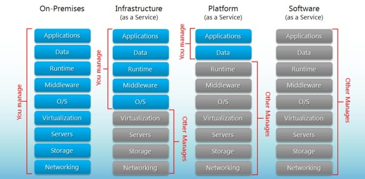

--- 
title: "FMISD19004 Cloud Computing Technologies"
author: "Kęstutis Daugėla"
date: "`r Sys.Date()`"
output:
  html_document:
    df_print: paged
bibliography: references.bib
biblio-style: apalike
link-citations: yes
site: bookdown::bookdown_site
citation_package: natbib
---

# Introduction {-}

The underlying concept of cloud computing was introduced way back in 1960s by John McCarthy in his book, “The challenge of the Computer Utility”. His opinion was that “computation may someday be organized as a public utility.” The rest became history and the majority of the sofware used now is running in the cloud seamlessly [@CloudHistoryOverview].

Cloud can solve a lot of problems nowadays - starting with reduced cost, enhanced security and flexible approach [@CloudReview] up to sustainability [@CloudSustainability] and accessibility around the world. Continuous Integration and Deployment (CI/CD) is easier then even treating now only the applications, but the whole infrastructure as code. This leads to enhanced productivity and cost optimization [@CloudAutomation]. 

Is there anything revolutional in the cloud offerings today? Definitely no - people used these capabilities for ages. The only difference is the scale and popularity these days.

Cloud services usually are grouped in three categories:

* SaaS (Software as a service) is a software distribution model in which a cloud provider hosts applications and makes them available to end users over the internet
* PaaS (Platform as a service) is a complete development and deployment environment in the cloud, with resources that enable you to deliver everything from simple cloud-based apps to sophisticated, cloud-enabled enterprise applications
* IaaS (Infrastructure as a service) is a type of cloud computing service that offers essential compute, storage, and networking resources on demand, on a pay-as-you-go basis

However,  despite  the  gain  achieved  from  cloud computing, the organizations are slow in accepting it due to security issues and  challenges associated with it [@Cloud-computing].

In terms of the leading cloud service providers, the same three names usually appears - Amazon (AWS), Microsoft (Azure) and Google (GCP). These are also one of the 5 largest companies in the world by market capitalization. While AWS has strength in engineering supply chain, large financial commitments and innovation, Google demonstrates a significant revenue growth, innovation velocity and show promising results in surveys. Moreover, since Google developed Kubernetes internally, GCP has the most fully featured Kubernetes service of any provider in this market. Microsoft, of the other hand, already had a good reputation and trust as a software company [@Gartner].

# Moving to cloud

## Managing SLA (SLO) requirements on clouds through scalability and reliability

One of the biggest challenge for potential cloud customers is to evaluate SLA’s of cloud vendors [@CloudSLA] [@CloudSLAComprehensive]. There are four major cloud setups in general:

1) **Public cloud**. In this setup users can access the resource pool that is managed by a cloud provider.Since this is a public cloud environment, it can pose important security concerns and extra measures need to be taken in order to prevent security issues.
2) **Private cloud**. The vendor provides the services which prevent public assess (e.g. dedicated servers)
3) **Community cloud** The cloud services are provided to a specified group where all members are entitled to equal access to the shared services.
4) **Hybrid cloud** The cloud services are provided as multiple cloud combustion (public cloud, private cloud, and community cloud)

It makes sense to compare the actual numbers between the  cloud strategy presented in 2019 with the actual survey made in 2021. Almost every cloud-ready company uses the public cloud (97%) to some extent leaving hybrid cloud setup the dominant (78%). 

Taking the functional requirements aside, security requirements represent a major issue that has to be met in order of easing some of these obstacles [@CloudRole].

## Migration to cloud approaches

The complexity of migrating existing applications varies, depending on the architecture and existing licensing arrangements. A virtualized, service-oriented architecture can be put on the low-complexity end of the spectrum, and a monolithic mainframe at the high-complexity end of the spectrum [@awsmigration]. Cloud  computing  advocates  that  resources  should  be  controlled  on  demand,  and  can  be flexibly and  elastically expanded  and contracted  according to  the change of demand [@CloudMigration]. Therefore it is preferred that applications moving into the cloud must run in a virtualized way, while virtual machines could work as a direct entry for other applications which cannot run directly in the cloud environment. Automation is an important aspect of the migration - while aiming for full automation could seem an overwhelming task, this will significantly reduce the time spent in the future and the challenge of managing these applications [@cloudautomation].

According to Forbes, there are now 77 % of organizations, having one or some parts of their systems in the cloud. The budgets are allocated through multiple services. E.g. in 2018 on average they were spent accordingly: 48% went to SaaS, 30% to IaaS, and 21% to PaaS. Gartner predicts that through 2025, 99% of cloud security failures will be the customer's fault.

[@CloudMigrationReview]

## Kubernetes in a nutshell

While virtualized applications is highly preferred as oppose to IaaS approach (virtual machines), it makes sense to dig deeper in kubernetes and docker setup, regardless of the chosen managed service.

Kubernetes was founded by Ville Aikas, Joe Beda, Brendan Burns, and Craig McLuckie in collaboration with Google engineers Brian Grant and Tim Hockin in mid-2014. Google's Borg system heavily influenced kubernetes design [@Borg] [@BorgKubernetes]. While the Borg project was implemented entirely in C++, Kubernetes was rewritten in Go language. The main goal of kubernetes was to build on the capabilities of containers and provide significant gains in programmer productivity while easing the management of the system. 

Kubernetes is the most popular container orchestration platform that enables users to create and run multiple containers in cloud environments. Kubernetes offers resource management to isolate the resource usage of containers on a host server because performance isolation is an important factor in terms of service quality.

## Use Case (R Case)

R is a programming language and free software environment for statistical computing and graphics. It is widely used among statisticians and data miners for developing statistical software and data analysis. R is usually used internally, mostly for interactive analysis and statistical modeling, but recently there are more and more applications in terms of WEB applications and APIs. While R is not the most popular language, it has no luxury in out of the box serving platform in most of the cloud providers. However, it can be nicely integrated with docker having all the dependencies in place and encapsulated application in a single container. This practice greatly speeds up the workflow of software development and deployment. In this proof of concept we will suggest the best approach of migrating R applications, shiny apps and APIs having a cloud provider selected.

Google Kubernetes Engine (GKE) is a great choice for a container orchestration platform and offers advanced scalability and configuration flexibility. GKE gives a complete control over every aspect of container orchestration, from networking, to storage, to how you set up observability—in addition to supporting stateful application use cases. A fully managed Cloud Run is the additional service based on GKE for those applications which do not need a comprehensive level of cluster configuration and monitoring. Additionally, the serverless approach provides more fine-grained billing and can significantly reduce the cost (e.g. in case the application is not in use). With a manually created GKE cluster, the nodes and environment are always on which means that you are billed for them regardless of utilization. With Cloud Run, the service is merely available and the billing is done only for the actual consumption. 

There are even more reasons to choose Cloud Run instead of Kubernetes cluster. Typically R users are not software engineers, so we should really aim for the simplicity not only for development flow, but the application management as well (e.g. Google Cloud Run application automatically scales up depending on the traffic). Cloud Run is also integrated with Stackdriver Monitoring, Logging, and Error Reporting services. Moreover, Cloud Run is is constructed on the Knative open‐source project, thus enabling portability of the workflows.

https://towardsdatascience.com/an-open-source-solution-to-deploy-enterprise-level-r-shiny-applications-2e19d950ff35

https://code.markedmondson.me/r-on-kubernetes-serverless-shiny-r-apis-and-scheduled-scripts/

https://www.linkedin.com/pulse/using-kubernetes-deploy-r-shiny-application-nosa-ugowe/

# Part II (TBA)

## Networking

## Security   

## Monitoring

## Use Case

# Part III (TBA)

## Infrastructure as Code 

## Data Governance

## Use Case

# References {-}

